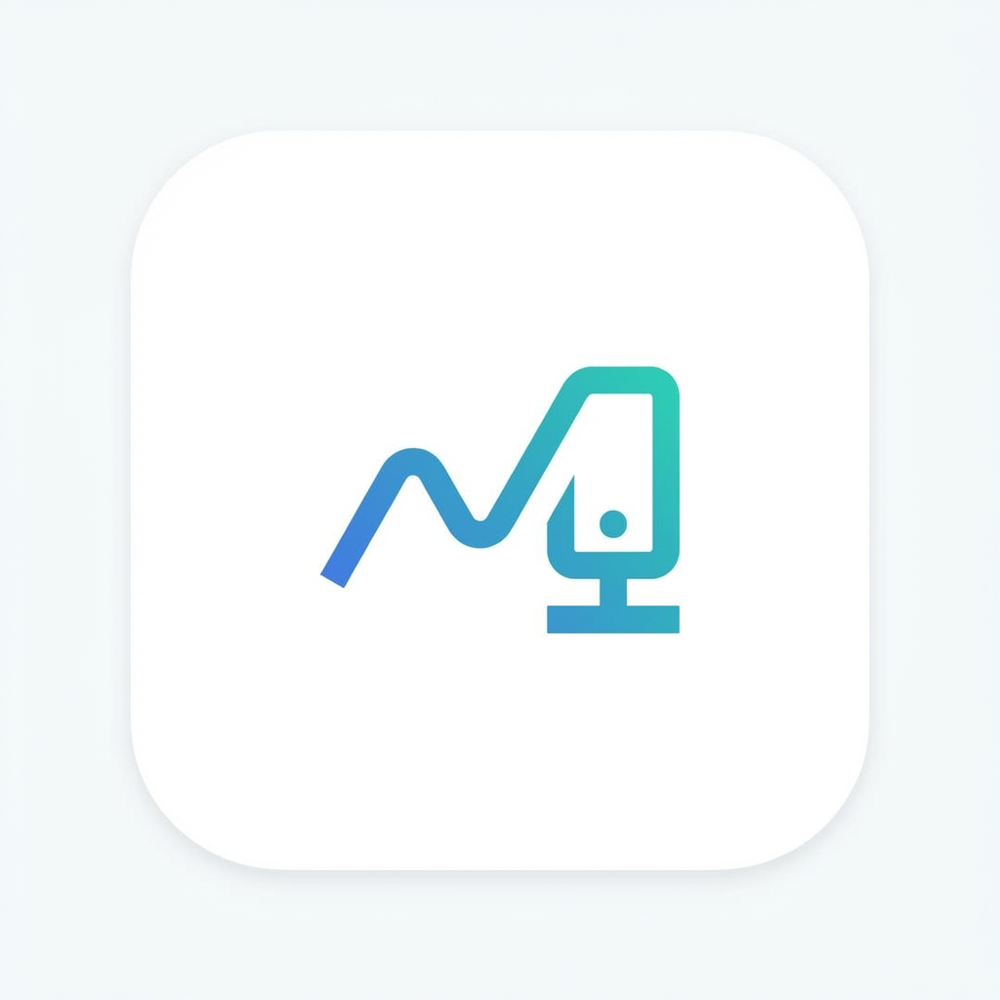

# Beszel Mobile

<p align="center">
  
</p>

A cross-platform mobile client for [Beszel](https://github.com/henrygd/beszel), a lightweight server monitoring hub.

This project is a fork of [beszel-android](https://github.com/bayroqdor/beszel-android), enhanced with new features, improved UI, and iOS support.

## ✨ Features

- **Dashboard**: View all your servers at a glance with real-time status, CPU, Memory, and Disk usage.
- **Detailed Monitoring**: 
  - **Task Manager Style View**: Deep dive into system performance with dedicated panels.
  - **Per-Core CPU**: Visualize usage of every CPU core.
  - **Network Traffic**: Monitor real-time upload/download rates for all interfaces.
- **Security**: 
  - **PIN Protection**: Secure your app with a 4-digit PIN.
  - **Biometric Auth**: Unlock with Fingerprint or Face ID (iOS & Android).
- **History**: Interactive charts for CPU, RAM, Disk, and Network usage (up to 24h history or more depending on server).
- **Multi-OS Support**: Optimized for Android and iOS (iOS 14+ compatible).
- **TrollStore Support**: Native support for generating unsigned IPAs for TrollStore users.

## 📱 Screenshots

| Dashboard | System Detail | Security |
|:---:|:---:|:---:|
|  |  |  |

*(Screenshots to be added)*

## 📥 Installation

### Android
Download the latest APK from [Releases](https://github.com/PTPAAA/beszel-mobile/releases).

### iOS
#### TrollStore Users
1. Download the `Beszel.ipa` from [Releases](https://github.com/PTPAAA/beszel-mobile/releases).
2. Install via TrollStore.

#### Standard Installation
Due to Apple's restrictions, you must sign the app yourself using AltStore, Sideloadly, or a developer account.

## 🛠️ Build from Source

### Prerequisites
- Flutter SDK (3.10.x or newer, stable channel recommended)
- Android Studio / Xcode

### Android Build
```bash
flutter build apk --release
```

### iOS Build
**Standard (requires signing):**
```bash
flutter build ios --release
```

**TrollStore (Unsigned IPA):**
You can use the included GitHub Actions workflow or run:
```bash
# Mobile device with macOS or generic Linux/Mac build environment
flutter build ios --release --no-codesign
mkdir -p Payload
cp -r build/ios/iphoneos/Runner.app Payload/
zip -r Beszel.ipa Payload
```

## 🌍 Localization
Supported languages:
- 🇺🇸 English
- 🇨🇳 Chinese (Simplified)
- 🇷🇺 Russian

## 🤝 Credits
- [Beszel](https://github.com/henrygd/beszel) - The amazing server monitoring hub.
- [beszel-android](https://github.com/bayroqdor/beszel-android) - The original Android client project.

## 📄 License
MIT License
